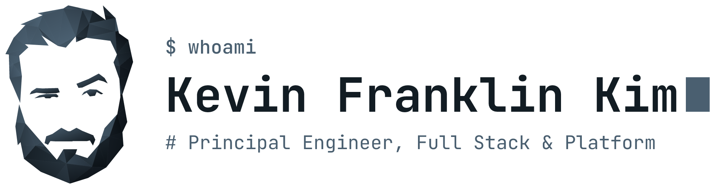

<picture>
  <source media="(prefers-color-scheme: dark)" srcset="./assets/lockup.png">
  
</picture>

---

Shipping software since 2006 full stack, wherever the tech stack leads me: from the browser to the cloud.

- **Products**: built end to end, from interface and services to the infrastructure they run on.
- **Frameworks** other engineers build on: service frameworks, RPC layers and code generators.
- **Tools** other engineers work with: CLIs, project shells and scanners that keep developer environments sane.
- **Teams**: leading and teaching them how to build, review and ship.

#### My open source contributions

---

[franklinkim.de](https://franklinkim.de) · [LinkedIn](https://www.linkedin.com/in/kevinfranklinkim/) · [XING](https://www.xing.com/profile/KevinFranklin_Kim) · [X](https://x.com/kfranklinkim)
